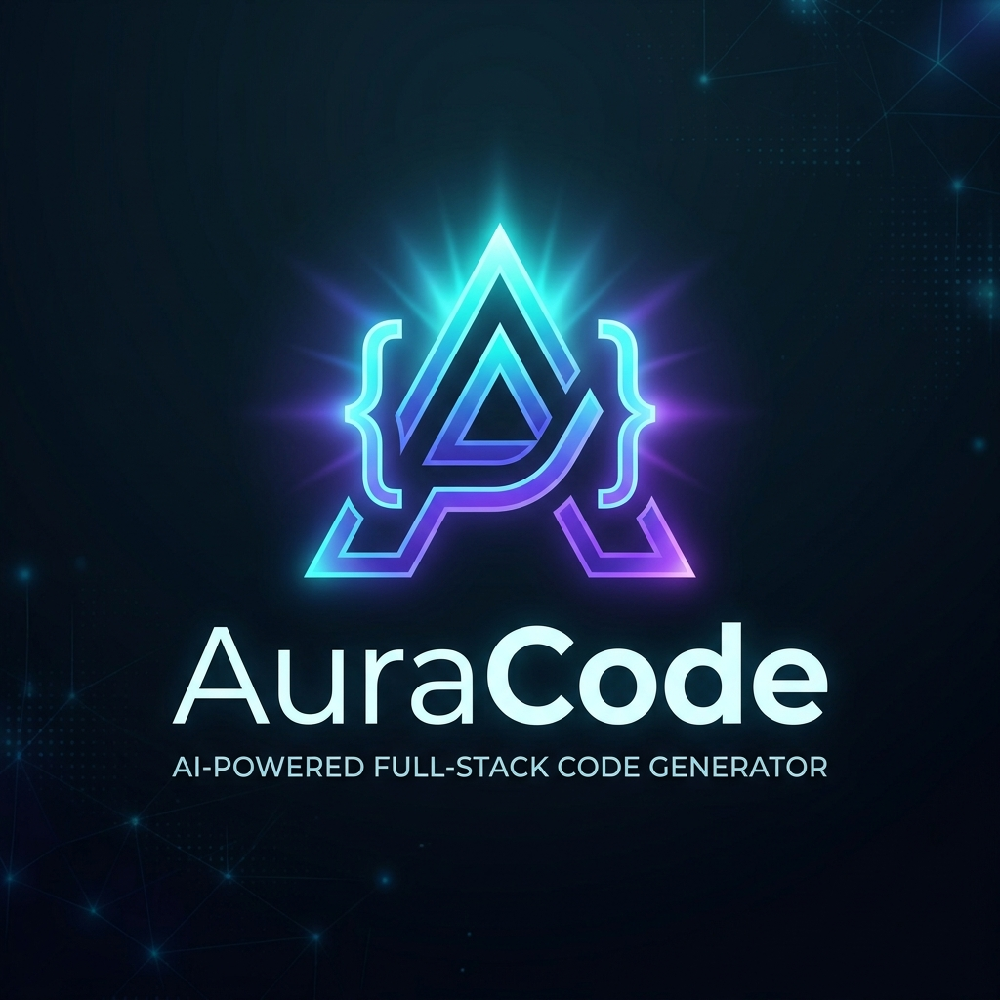
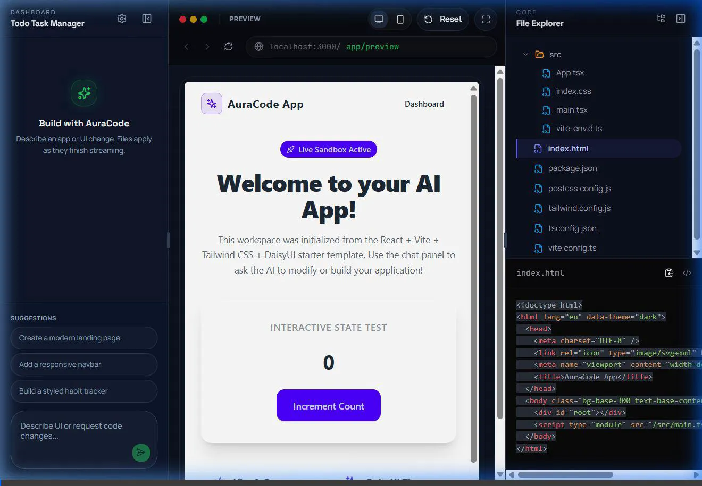
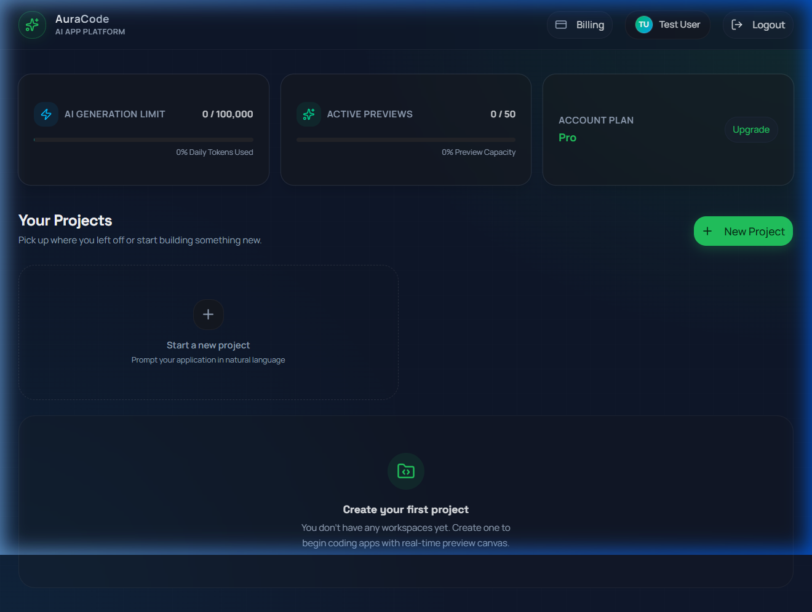
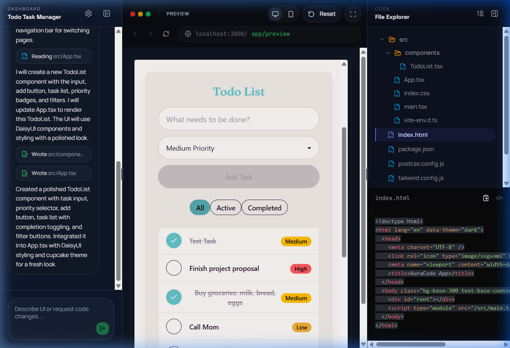
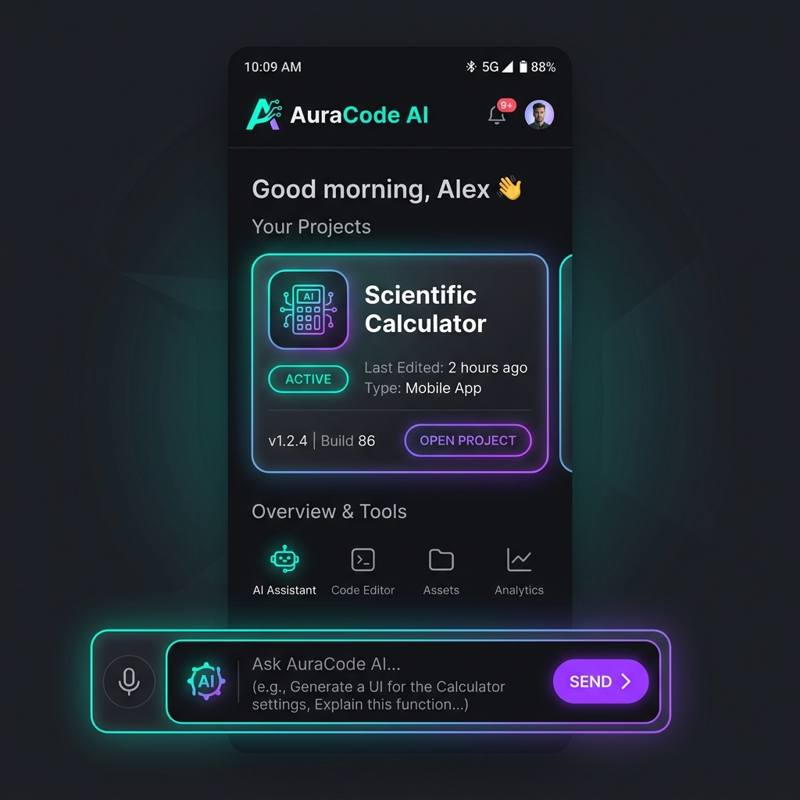

# 🚀 Lovable Clone — Full-Stack AI App Generator

<div align="center">
  

  <p align="center">
    <b>A powerful, full-stack AI-powered application generation platform inspired by <a href="https://lovable.dev">Lovable</a>.</b><br />
    Build, preview, and deploy full-stack applications instantly using natural language prompts.
  </p>

  <p align="center">
    
    
    
    
    
    
  </p>
</div>

---

## ✨ Features

### 💻 Modern Frontend
- **🤖 Interactive AI Workspace**: Dynamic chat interface with real-time SSE streaming for instant code generation.
- **⚡ Live Sandpack Preview**: Real-time app preview and inline code editing powered by CodeSandbox Sandpack.
- **📊 Premium Dashboard**: Clean, modern dark-mode dashboard to organize and manage all your AI-generated projects.
- **💳 Stripe Subscription & Billing**: Complete subscription lifecycle management with Stripe Checkout, Webhooks, and Plan Comparisons.
- **👥 Real-Time Collaboration**: Invite team members, configure RBAC roles (Owner/Editor/Viewer), and build together.
- **🎨 Elite Dark Theme UI**: Sleek, high-fidelity dark-mode interface built with Tailwind CSS, Framer Motion, and Radix/Shadcn UI.

### 📱 Native Android Mobile App
- **🎨 Sleek Compose UI**: Modern, fluid Jetpack Compose user interface matching the high-fidelity dark-mode web dashboard.
- **🤖 Mobile Prompting Workspace**: Direct integration with Spring AI/SSE backend for streaming chat and code generation on-the-go.
- **⚡ In-App Web Preview Sandbox**: Run React, Next.js, and HTML templates directly on device utilizing a client-side Sandpack rendering engine inside custom interactive WebViews.
- **📂 Workspace Code & Files View**: Browse and explore full project file hierarchies dynamically from your mobile phone.
- **💳 Native Billing Checkout**: Complete subscription management and upgrade flows via customized Stripe checkout web interfaces.

### ⚙️ Robust Backend
- **☕ Spring Boot 4 REST API**: High-throughput RestControllers built with Java 21 and Spring Web.
- **🧠 Spring AI Integration**: Native integration with OpenAI GPT models for smart code generation.
- **🔒 Stateful & Stateless Security**: JWT-based session filters and method-level access control (@EnableMethodSecurity).
- **📂 MinIO Hybrid File Storage**: High-performance object storage for project file trees with a PostgreSQL database fallback.


## 🌐 Production Environment (Live Deployment)

The platform is deployed and running live on Azure Container Apps with the following endpoints:

* **Frontend Web Application**: [https://auracode-web.whitemeadow-09bf00ac.centralus.azurecontainerapps.io](https://auracode-web.whitemeadow-09bf00ac.centralus.azurecontainerapps.io)
* **Backend API Gateway**: [https://auracode-api.whitemeadow-09bf00ac.centralus.azurecontainerapps.io](https://auracode-api.whitemeadow-09bf00ac.centralus.azurecontainerapps.io)
* **Swagger API Documentation**: [https://auracode-api.whitemeadow-09bf00ac.centralus.azurecontainerapps.io/swagger-ui/index.html](https://auracode-api.whitemeadow-09bf00ac.centralus.azurecontainerapps.io/swagger-ui/index.html)
* **MinIO Object Storage Console**: [https://auracode-minio.whitemeadow-09bf00ac.centralus.azurecontainerapps.io](https://auracode-minio.whitemeadow-09bf00ac.centralus.azurecontainerapps.io)

---

## 📸 Production Gallery

### 1. Interactive Prompt Execution (Live Walkthrough)
The recorded demonstration below displays streaming AI code generation, automatic MinIO bucket writing, and instant live Sandpack compilation:

<div align="center">
  
</div>

### 2. Premium Pro Dashboard (Upgraded via Stripe Webhook)
After a successful test subscription checkout via Stripe, our live Webhook endpoint processes the payload and upgrades the dashboard layout, introducing expanded token and active preview limits:

<div align="center">
  
</div>

### 3. Glassmorphic Calculator Workspace
The code editor and live preview panel compiling a premium glassmorphic Scientific Calculator generated directly by the platform's AI:

<div align="center">
  
</div>

---

## 📸 Application Demo

The animation above showcases the user flow end-to-end:
1. **Seamless Sign Up & Login** (JWT authentication).
2. **Dashboard Project Creation** (metadata persistence & project seeding).
3. **Workspace File Tree & Code Editor** (exploring files, real-time code preview).
4. **Subscription Plan Upgrades** (Stripe-ready pricing layout).

---

## 📋 API Route Reference

The backend runs on `http://localhost:8080` by default.

| Category | Endpoint | Method | Description |
| :--- | :--- | :--- | :--- |
| **Auth** | `/api/auth/login` | `POST` | Authenticate user & return JWT token |
| **Auth** | `/api/auth/signup` | `POST` | Create a new user account |
| **Projects**| `/api/projects` | `GET/POST` | List all user projects / Create a new project |
| **Projects**| `/api/projects/{id}` | `GET/DELETE` | Retrieve project details / Delete project |
| **Members** | `/api/projects/{id}/members` | `GET/POST` | List members / Invite member to project |
| **Files** | `/api/projects/{id}/files` | `GET/PUT` | Retrieve file tree / Update file contents |
| **Chat** | `/api/chat/stream` | `GET` | SSE endpoint for streaming AI code generation |
| **Billing** | `/api/payments/checkout` | `POST` | Create Stripe Checkout Session |
| **Usage** | `/api/usage/today` | `GET` | Retrieve daily token and preview slots usage |

---

## 🛠️ System Architecture & Implementation

Here is a deep dive into the engineering behind Lovable Clone:

### 1. Security & RBAC Guardrails (`security/`)
- Enforces strict role-based access control (RBAC). For example, a user must be a project member to see or edit its files.
- Uses `@security.canViewProject(#id)` and `@security.canEditProject(#id)` inside method security annotations.
- Implements custom `JwtAuthFilter` that properly registers the auth principal during async requests (like Server-Sent Events chat stream).

### 2. Streamlined AI Code Generation (`llm/`, `service/`)
- Integrates **Spring AI** to construct multi-file code responses.
- Implements **LlmResponseParser** to parse LLM outputs into structured project files in real-time.
- Supports streaming of file updates over Server-Sent Events (SSE).

### 3. Subscription & Usage Limits (`stripe/`, `service/`)
- Automatically seeds default billing plans into the PostgreSQL database at startup via `BillingPlansInitializer`.
- Monitors daily tokens and active preview usage slots, preventing abuse on free tiers.

---

## 🚀 Getting Started

### Prerequisites
- **Java 21** & Maven
- **Node.js 20+**
- **Docker & Docker Compose**
- **OpenAI API Key** (for code generation)

### 1. Launch Infrastructure
Start PostgreSQL (with pgvector support) and MinIO services:
```bash
docker compose -f services.docker-compose.yml up -d
```

### 2. Backend Setup
Create your local configuration profile. Copy the template and add your API keys:
```bash
cp application-local.yml.example src/main/resources/application-local.yml
```
Run the Spring Boot application (using local profile with timezone override to prevent PG timezone conflicts):
```bash
$env:DB_PASSWORD="password"; $env:OPENAI_API_KEY="your-openai-key"; $env:SPRING_PROFILES_ACTIVE="local"; $env:MAVEN_OPTS="-Duser.timezone=UTC"; .\mvnw.cmd spring-boot:run
```

### 3. Frontend Setup
Navigate to the frontend directory, install dependencies, and launch the Next.js development server:
```bash
cd frontend
npm install
npm run dev
```

Visit the app at **`http://localhost:5173`**.

### 4. Android App Setup
Open the [`Android App`](file:///c:/Lovable%20Git/Android%20App) folder in Android Studio.
The application connects automatically to the live deployed Azure backend by default (`https://auracode-api.whitemeadow-09bf00ac.centralus.azurecontainerapps.io`).
If you want to configure it to point to a local instance of the backend:
- Update `API_BASE_URL` inside [`Android App/app/build.gradle.kts`](file:///c:/Lovable%20Git/Android%20App/app/build.gradle.kts):
```kotlin
buildConfigField("String", "API_BASE_URL", "\"http://10.0.2.2:8080\"") // 10.0.2.2 is the localhost gateway for the Android Emulator
```
Build and run on your emulator or physical Android device.

---

## ☁️ Production on Azure (Container Apps)

**Primary cloud target.** Stack: **Azure Container Apps** (API + Next.js + MinIO) · **Azure Database for PostgreSQL** · **Key Vault** · **Azure Container Registry** · GitHub Actions.

```text
User → Container App (frontend) → Container App (backend) → Azure Postgres
                                   → Container App (MinIO / S3 API)
                                   → Key Vault / OpenAI / Stripe
```

> GCP scripts under [`deploy/gcp/`](deploy/gcp/) and [`cloudbuild.yaml`](cloudbuild.yaml) remain as an optional alternate; Azure is the documented path going forward.

### Required environment variables

| Variable | Where | Purpose |
|---|---|---|
| `SPRING_PROFILES_ACTIVE=prod` | Backend | Loads `application-prod.yml` |
| `SPRING_DATASOURCE_URL` | Backend | Azure Postgres JDBC URL (`?sslmode=require`) |
| `DB_USER` / `DB_PASSWORD` | Backend | Database credentials (Key Vault) |
| `JWT_SECRET_KEY` | Backend | JWT HMAC secret (**32+ random bytes**; never commit) |
| `OPENAI_API_KEY` | Backend | Spring AI / generation |
| `STRIPE_API_KEY` / `STRIPE_WEBHOOK_SECRET` | Backend | Billing |
| `CLIENT_URL` / `CORS_ALLOWED_ORIGINS` | Backend | Frontend origin |
| `MINIO_URL` | Backend | MinIO Container App HTTPS URL |
| `MINIO_ACCESS_KEY` / `MINIO_SECRET_KEY` | Backend | MinIO root credentials |
| `MINIO_PROJECT_BUCKET` | Backend | Bucket name for project files |
| `NEXT_PUBLIC_API_BASE_URL` | Frontend **build arg** | Absolute API URL (SSE + REST) |
| `PORT` | Both | `8080` |

Azure Postgres JDBC example:

```text
jdbc:postgresql://auracode-pg.postgres.database.azure.com:5432/auracode?sslmode=require
```

**Stripe webhook:** `https://<backend-fqdn>/webhooks/payment`  
**Health:** `https://<backend-fqdn>/actuator/health`

### Deploy with Azure CLI (recommended)

1. Install [Azure CLI](https://learn.microsoft.com/cli/azure/install-azure-cli) and run `az login`.
2. Copy and fill config:

```bash
cp deploy/azure/config.env.example deploy/azure/config.env
# SUBSCRIPTION_ID, LOCATION, ACR_NAME, KEY_VAULT_NAME, DB_PASSWORD,
# JWT_SECRET_KEY, OPENAI_API_KEY, MINIO_SECRET_KEY, STRIPE_*, etc.
```

3. Bootstrap infrastructure, then apps (Git Bash / WSL / Azure Cloud Shell):

```bash
bash deploy/azure/bootstrap.sh
bash deploy/azure/06-deploy-minio.sh
bash deploy/azure/07-deploy-backend.sh      # FRONTEND_URL may be temporary
bash deploy/azure/08-deploy-frontend.sh
# FRONTEND_URL is written to config.env — re-run backend for CORS:
bash deploy/azure/07-deploy-backend.sh
```

4. Point Stripe at `https://<backend>/webhooks/payment`, store the signing secret in Key Vault / `config.env`, redeploy backend.

Scripts: [`deploy/azure/`](deploy/azure/). CI: [`.github/workflows/azure-container-apps.yml`](.github/workflows/azure-container-apps.yml).

### Browser (Azure Portal) quick path

1. Portal → create Resource Group + Container Registry + PostgreSQL Flexible Server + Key Vault.  
2. Open **Cloud Shell**, clone the repo, fill `deploy/azure/config.env`, run the same `bootstrap` / `06`–`08` scripts above.  
3. Apps appear under **Container Apps**; open the frontend FQDN in the browser.

### Local production-image smoke test

```bash
export JWT_SECRET_KEY="replace-with-long-random-secret"
export OPENAI_API_KEY="sk-..."
docker compose -f docker-compose.prod.yml up --build
```

- API: `http://localhost:8080` (`/actuator/health`)
- Swagger UI: `http://localhost:8080/swagger-ui/index.html`
- Web: `http://localhost:3000`

Dockerfiles: [`Dockerfile.backend`](Dockerfile.backend), [`frontend/Dockerfile`](frontend/Dockerfile).

---

## 📈 Roadmap & Progress
- [x] **Auth & RBAC**: JWT login/signup with project-level permissions.
- [x] **Project Management**: Project creation, deletion, and dashboard UI.
- [x] **AI App Generator**: SSE streaming code generation with file tree persistence.
- [x] **Sandpack Sandbox**: Live execution of React/Next.js files in-browser.
- [x] **Stripe Integration**: Plan seeding, checkout redirects, and portal management.
- [x] **Usage Guardrails**: Token quotas and active preview limits.
- [x] **Team Collaboration**: Invite system with Owner, Editor, Viewer roles.
- [x] **📱 Android Mobile Client**: Native Android application for AuraCode with live previews, full project editing, and checkout integration.
- [ ] **One-Click Deployments**: Direct deployment of generated apps to Vercel/Netlify.

---

## 📱 Native Android Mobile Client

To extend AuraCode to mobile environments, the **AuraCode Android Client** provides a fully native experience built from the ground up with Kotlin and Jetpack Compose.

### Key Features:
* **Mobile Workspace**: Prompt and preview your web applications directly on your phone or tablet.
* **In-App Sandpack WebView Preview**: Render dynamically generated React, Next.js, and HTML projects client-side in an interactive mobile preview component.
* **Stripe Checkout Web Interface**: Seamlessly upgrade plans and purchase tokens directly from within the app.
* **Hilt Dependency Injection**: Modular architecture using Hilt, Retrofit, KotlinX Serialization, OkHttp, and Coroutines.

<div align="center">
  
  <p><i>Sleek mobile dashboard and code preview generator (Fully Implemented)</i></p>
</div>

---

## 🔗 Project Info & License
- **Repository:** [Snehil208001/Lovable_Clone](https://github.com/Snehil208001/Lovable_Clone)
- **License:** Educational and personal use only.

