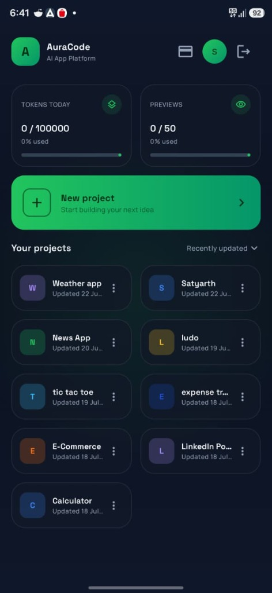
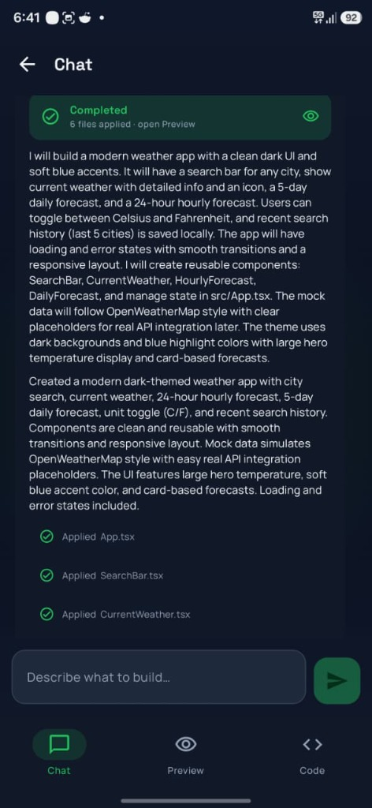
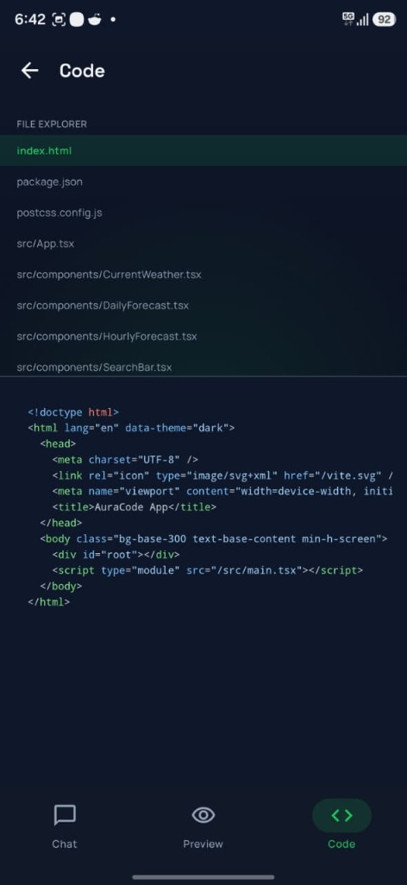
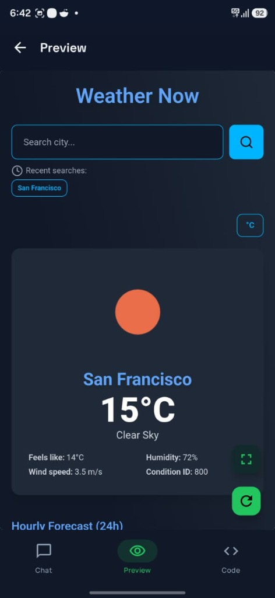
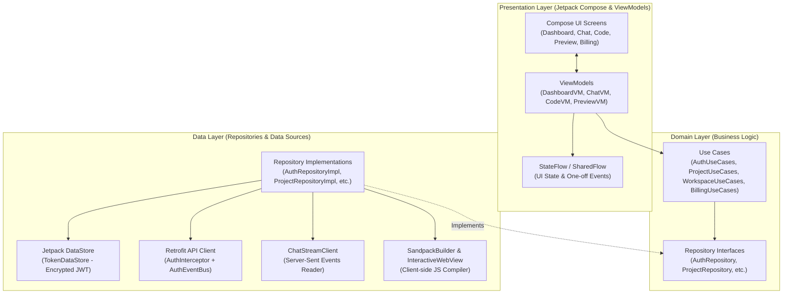

# 🚀 AuraCode — Full-Stack & Native Android AI App Generator

<div align="center">
  

  <p align="center">
    <b>A powerful, full-stack AI-powered application generation platform featuring a native Android mobile application & Next.js web application.</b><br />
    Build, preview, and interact with generated full-stack applications instantly using natural language prompts on mobile and web.
  </p>

  <p align="center">
    
    
    
    
    
    
    
  </p>
</div>

---

## 📱 Native Android Mobile App (Recruiter Showcase)

The **AuraCode Android Client** is a feature-rich, production-grade native Android app built using **Kotlin**, **Jetpack Compose**, and **Clean Architecture + MVVM**. It allows users to write prompts, stream AI code generation in real-time, view dynamic project file trees, compile React/HTML templates on-device in an interactive WebView, and manage subscriptions.

<div align="center">
  <table>
    <tr>
      <td align="center" width="25%">
        <br/>
        <sub><b>1. Mobile Dashboard</b></sub>
      </td>
      <td align="center" width="25%">
        <br/>
        <sub><b>2. SSE Streaming AI Chat</b></sub>
      </td>
      <td align="center" width="25%">
        <br/>
        <sub><b>3. File Tree & Code View</b></sub>
      </td>
      <td align="center" width="25%">
        <br/>
        <sub><b>4. On-Device Web Preview</b></sub>
      </td>
    </tr>
  </table>
  <p><i>Full Mobile User Flow: Project Dashboard → SSE Code Generation → Source File Tree → On-Device Sandpack Compilation</i></p>
</div>

---

### ⚡ Recruiter Fast-Track (APK & Demo Credentials)

Recruiters can immediately install and test the live application on an Android device or emulator without setting up the environment:

| Resource | Access Link / Details |
| :--- | :--- |
| **📥 Direct APK Download** | [**`auracode-android-client.apk`**](apk/auracode-android-client.apk) *(Pre-compiled & ready to install)* |
| **🔑 Demo Account Email** | `snehil@gmail.com` |
| **🔐 Demo Password** | `Snehil@123` |
| **🌐 Cloud Backend Target** | Live Azure API: `https://auracode-api.whitemeadow-09bf00ac.centralus.azurecontainerapps.io` |

---

### 🏛️ Android Architecture & Engineering Deep Dive

The Android client is architected following Google’s recommended **Clean Architecture** combined with the **MVVM (Model-View-ViewModel)** design pattern. It enforces strict layer isolation, unidirectional data flow, and modularity.



#### 🔑 Key Architectural Components:

1. **Clean Architecture Layering**:
   - **`domain`**: Contains pure Kotlin entities (`Project`, `User`, `StreamEvent`), abstract repository interfaces, and use-cases (`AuthUseCases`, `WorkspaceUseCases`). Has zero dependencies on Android SDK or external libraries.
   - **`data`**: Responsible for network communication, local storage, DTO parsing, and repository implementations (`ProjectRepositoryImpl`, `AuthRepositoryImpl`).
   - **`mainui` & `ui`**: Presentation layer featuring Jetpack Compose screens (`DashboardScreen`, `WorkspaceScreen`, `ChatScreen`, `CodeScreen`, `PreviewScreen`) and stateful ViewModels.

2. **UI Layer (Jetpack Compose & Material 3)**:
   - **Declarative UI**: Built entirely with Jetpack Compose using dynamic dark-mode styling, glassmorphism card layouts, and custom theme system (`Color.kt`, `Theme.kt`, `Type.kt`).
   - **Unidirectional Data Flow (UDF)**: ViewModels expose immutable `StateFlow` streams. Screens consume UI state safely with `collectAsStateWithLifecycle()`.

3. **Dependency Injection (Dagger Hilt)**:
   - Centralized dependency graphs configured via `@HiltAndroidApp` and modules (`NetworkModule.kt`, `RepositoryModule.kt`).
   - Standardizes ViewModel lifecycle binding (`@HiltViewModel`) and interface implementations.

4. **Reactive & Asynchronous Concurrency**:
   - **Kotlin Coroutines & Flow**: Offloads network and I/O tasks from the Main Looper thread to `Dispatchers.IO`.
   - **StateFlow & SharedFlow**: Handles persistent state updates (e.g. file trees, chat logs) and one-time UI events (e.g. snackbar alerts, navigation redirects).

5. **Networking & Auth Security**:
   - **Retrofit 2 & OkHttp 4**: Standardized REST client handling all backend API communications (`AuraCodeApi.kt`).
   - **`AuthInterceptor`**: Automatically injects JWT Bearer tokens retrieved from `TokenDataStore` into HTTP headers.
   - **`AuthEventBus`**: Reactive channel catching 401 Unauthorized responses to seamlessly trigger app-wide logout and user re-authentication.

6. **Real-Time Streaming Engine (SSE)**:
   - **`ChatStreamClient`**: Implements custom OkHttp EventSource parsing to stream Server-Sent Events (SSE) from Spring AI (`/api/chat/stream`).
   - Parses streaming JSON chunks on-the-fly and updates file tree structures incrementally in memory.

7. **On-Device Sandpack Web Rendering Engine**:
   - **`SandpackBuilder` & `InteractiveWebView`**: Synthesizes generated React/Next.js files into an executable HTML/JS payload and executes it inside a customized Android `WebView`.
   - **`PreviewErrorAnalyzer` & `PreviewRepairBus`**: Captures client-side JavaScript console errors from the WebView and emits repair prompts back to the AI for auto-debugging.

8. **Secure Token Storage**:
   - **`TokenDataStore`**: Built on Android **Jetpack DataStore** to store JWT tokens and user profile preferences securely.

---

## ✨ Full-Stack Platform Features

### 💻 Modern Web Frontend (Next.js 15)
- **🤖 Interactive AI Workspace**: Real-time SSE streaming for multi-file app code generation.
- **⚡ Live Sandpack Preview**: Sandpack compilation with live side-by-side preview and code editor.
- **📊 Dark Theme Dashboard**: Dark-mode project dashboard with real-time preview usage tracking.
- **💳 Stripe Subscription & Billing**: Webhook integration for automated plan upgrades and token quota resets.

### ⚙️ Robust Spring Boot 4 Backend
- **☕ High-Throughput REST API**: Java 21 REST controllers with Spring Web and Security.
- **🧠 Spring AI Integration**: Direct integration with OpenAI GPT models and SSE streaming (`AiGenerationService`).
- **🔒 Security & RBAC**: Method-level security annotations (`@security.canViewProject`) with JWT filters.
- **📂 MinIO Hybrid File Storage**: Object storage persistence for multi-file project structures with PostgreSQL fallback.

---

## 🌐 Production Environment (Live Deployment)

The platform is deployed live on **Azure Container Apps**:

* **Frontend Web Application**: [https://auracode-web.whitemeadow-09bf00ac.centralus.azurecontainerapps.io](https://auracode-web.whitemeadow-09bf00ac.centralus.azurecontainerapps.io)
* **Backend API Gateway**: [https://auracode-api.whitemeadow-09bf00ac.centralus.azurecontainerapps.io](https://auracode-api.whitemeadow-09bf00ac.centralus.azurecontainerapps.io)
* **Swagger API Documentation**: [https://auracode-api.whitemeadow-09bf00ac.centralus.azurecontainerapps.io/swagger-ui/index.html](https://auracode-api.whitemeadow-09bf00ac.centralus.azurecontainerapps.io/swagger-ui/index.html)
* **MinIO Object Storage Console**: [https://auracode-minio.whitemeadow-09bf00ac.centralus.azurecontainerapps.io](https://auracode-minio.whitemeadow-09bf00ac.centralus.azurecontainerapps.io)

---

## 📸 Production Gallery

### 1. Interactive Prompt Execution (Live Walkthrough)
<div align="center">
  
</div>

### 2. Premium Pro Dashboard
<div align="center">
  
</div>

### 3. Glassmorphic Calculator Workspace
<div align="center">
  
</div>

---

## 📋 API Route Reference

Backend running on `http://localhost:8080` (or Azure production endpoint):

| Category | Endpoint | Method | Description |
| :--- | :--- | :--- | :--- |
| **Auth** | `/api/auth/login` | `POST` | Authenticate user & return JWT token |
| **Auth** | `/api/auth/signup` | `POST` | Create a new user account |
| **Projects**| `/api/projects` | `GET/POST` | List user projects / Create project |
| **Projects**| `/api/projects/{id}` | `GET/DELETE` | Retrieve project details / Delete project |
| **Members** | `/api/projects/{id}/members` | `GET/POST` | List members / Invite member to project |
| **Files** | `/api/projects/{id}/files` | `GET/PUT` | Retrieve file tree / Update file contents |
| **Chat** | `/api/chat/stream` | `GET` | SSE endpoint for streaming AI code generation |
| **Billing** | `/api/payments/checkout` | `POST` | Create Stripe / Cashfree Checkout Session |
| **Usage** | `/api/usage/today` | `GET` | Retrieve daily token and preview slot quotas |

---

## 🚀 Local Development Setup

### Prerequisites
- **Android Studio Ladybug / Jellyfish** (with Kotlin 2.0+)
- **Java 21** & Maven 3.9+
- **Node.js 20+**
- **Docker & Docker Compose**

### 1. Running the Android Application
1. Open the [`Android App`](Android%20App) folder in Android Studio.
2. The app connects to the live Azure backend by default (`https://auracode-api.whitemeadow-09bf00ac.centralus.azurecontainerapps.io`).
3. To switch to a local backend instance, edit `API_BASE_URL` in [`Android App/app/build.gradle.kts`](Android%20App/app/build.gradle.kts):
   ```kotlin
   buildConfigField("String", "API_BASE_URL", "\"http://10.0.2.2:8080\"") // 10.0.2.2 is Android Emulator localhost
   ```
4. Sync Gradle and press **Run** (or execute `./gradlew assembleDebug` to build the APK).

### 2. Running Backend Infrastructure
```bash
# Launch Postgres & MinIO
docker compose -f services.docker-compose.yml up -d

# Start Spring Boot Backend
$env:DB_PASSWORD="password"; $env:OPENAI_API_KEY="your-key"; $env:SPRING_PROFILES_ACTIVE="local"; .\mvnw.cmd spring-boot:run
```

### 3. Running Frontend Web App
```bash
cd frontend
npm install
npm run dev
```

---

## 🔗 Project Info & License
- **GitHub Repository:** [Snehil208001/Lovable_Clone](https://github.com/Snehil208001/Lovable_Clone)
- **Author:** Snehil ([snehil@gmail.com](mailto:snehil@gmail.com))
- **License:** Educational and personal portfolio use only.
